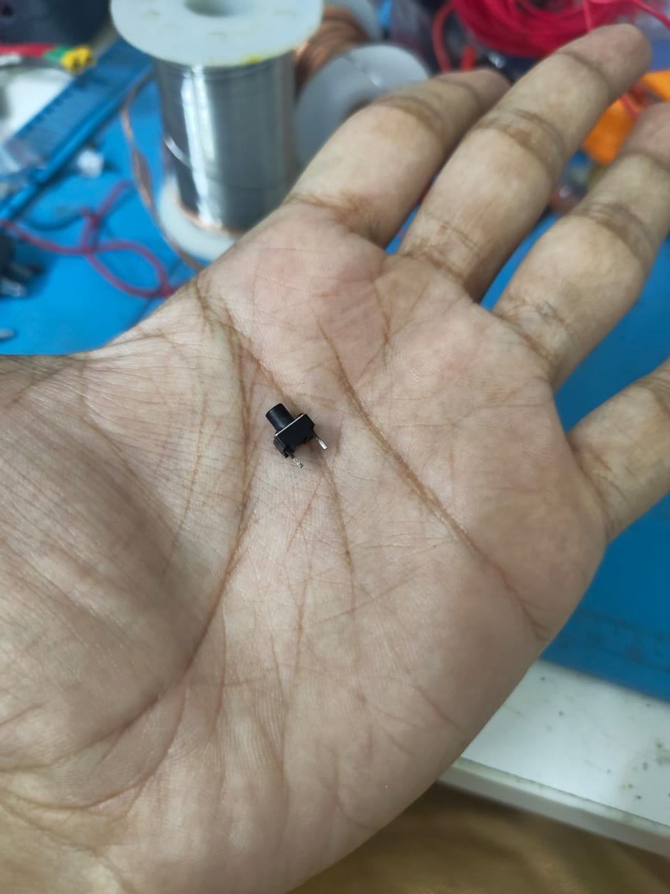
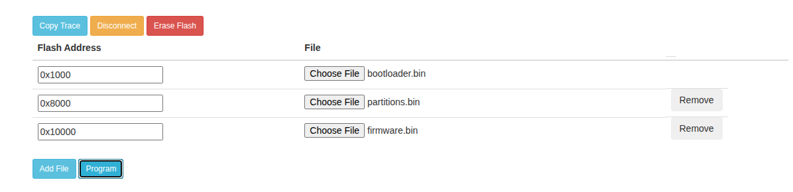

# ✈️ ESP32 E-Paper Aircraft Tracker

A real-time aircraft tracking display using the OpenSky Network and a 4.2" e-paper display powered by an ESP32.

---

## 📦 Project Overview

This project uses an ESP32 microcontroller paired with a 4.2" e-paper display to show nearby aircraft data in real-time. It fetches live flight information using the OpenSky Network API and enhances it with aircraft metadata from PlaneSpotters. Key features include:

- 📡 **Live aircraft tracking** via OpenSky REST API  
- 🌐 **Captive portal for Wi-Fi and API configuration**  
- 🕒 **Time zone-aware clock rendering**  
- 🛩 **Aircraft metadata display** (model, callsign, country, bearing, distance)  
- 📟 **Flicker-free partial updates on e-paper display**  
- 🧠 **On-device caching** for up to 30 aircraft entries  

---

## 🧱 Hardware Requirements

| Component               | Notes                                 | Image & Buy Link |
|------------------------|----------------------------------------|------------------|
| ESP32 Dev Board        | At least 4MB flash (any model)         | <br>[Buy](https://robu.in/product/esp32-wroom-32d-iot-development-doard-module-for-arduino/?gad_source=1&gad_campaignid=17413441824) |
| Waveshare 4.2" E-Paper | Use the `epd4in2_V2` model              | <br>[Buy](https://www.waveshare.com/4.2inch-e-paper-module.htm) |
| Pushbutton             | For entering Config Mode (GPIO 2)      | <br>[Buy on Amazon](https://www.amazon.in/s?k=push+button+tactile) |


---

## 🗂 File Structure
```
src/
├── main.cpp                 # Main application entry point
├── config.h / config.cpp    # Captive portal and preference saving
├── display.h / display.cpp  # All e-paper rendering logic
├── fetch.h / fetch.cpp      # API interaction (OpenSky + PlaneSpotters)
├── cache.h / cache.cpp      # Circular cache for aircraft data
└── OpenSkyAuthClient.h/.cpp # OAuth2 token management
```

---

## ⚙️ How to DIY

### Software setup
### 🔧 1. get Openskynet API credentials

- Create an [OpenSky Network](https://auth.opensky-network.org/auth/realms/opensky-network/protocol/openid-connect/auth?response_type=code&client_id=website-ui&scope=openid&redirect_uri=https%3A%2F%2Fopensky-network.org%2Fredirect-uri&state=6946459d-6755-4361-887d-81976590974b) account 

- Sign in to your account, then under `API Client` click `Create & Download Credential`.
- credential file will be downloaded as `credentials.json`, in that your clientId	and clientSecret will be precent, keep this info for now we need it later.

### 🚀 2. Firmware upload to ESP32

- Download release ZIP, and extract them, inside you find Bootloader.bin, partition.bin and firmware.bin.
- Go to [ESP online flasher](https://espressif.github.io/esptool-js/).
- connect you ESP with the machine while holding the boot button of the esp, then on browser under 'program' click connect, a popup will appear choose the serial port the esp is connected and click connect on popup box again now the esp should be connected [note: if esp didnt connect, plug out the esp and then hold the boot button then plug back in keep holding the boot button till you get connected with esp]
- by clicking on add file you can add files and choose the appiriate files as shown on the image, and click program this might take a while
  
   
### Hardware setup
### 🖥 1. Wire connection
- Connect Waveshare E-paper display with ESP
- attach a config button to ESP's gpio 2

### Full setup
- now that both hardware and software setup is done power on the ESP via USB or any prefered source
- esp will automatically detect when there is no valid credentails and boots to config mode. [note: if ESP not in config mode, you can put esp in config mode manually by pressing the config button on gpio 2 when plugging in]
- in config mode the ESP will give out open wifi named `WC_Sky_display` connect to the wifi
- and enter this on the url of your brower `192.168.4.1` from the device connected to esp's wifi
- config page will appear, enter your credentials including clientId	and clientSecret which we downloaded earlier
- once done click save , the display will refresh and boot 

---

## 🧠 Key Features

### 🕒 Timezone-Aware Clock

- Timezone offset is user-configured (e.g., `+05:30` → `+330` minutes).
- Uses `strftime` for proper formatting after applying offset.

### 🧠 Caching System

- `AircraftCacheEntry[]` includes:
  - `icao24`, `model`, `callsign`, `distance`, `bearing`, `active`
- Ring buffer with 30 entries (cycled via `cacheIndex`).
- Sorted by distance using `sortAircraftCacheByDistance()`.

### 🖼 E-Paper Refresh Logic

- **Partial updates** for normal refreshes (e.g., aircraft or time change).
- **Full updates** only when switching between states (e.g., no aircraft → aircraft detected).

- **No Aircraft Nearby:**
  - Displays local time, date, and a message.
  - Uses partial update (no flicker).

- **Aircraft Nearby:**
  - Displays up to 5 aircraft.
  - Alternates entries using inverted color blocks.
  - Shows time and aircraft count in the header.
---

## 🔧 Setup (PlatformIO)

Your `platformio.ini` should look like:

